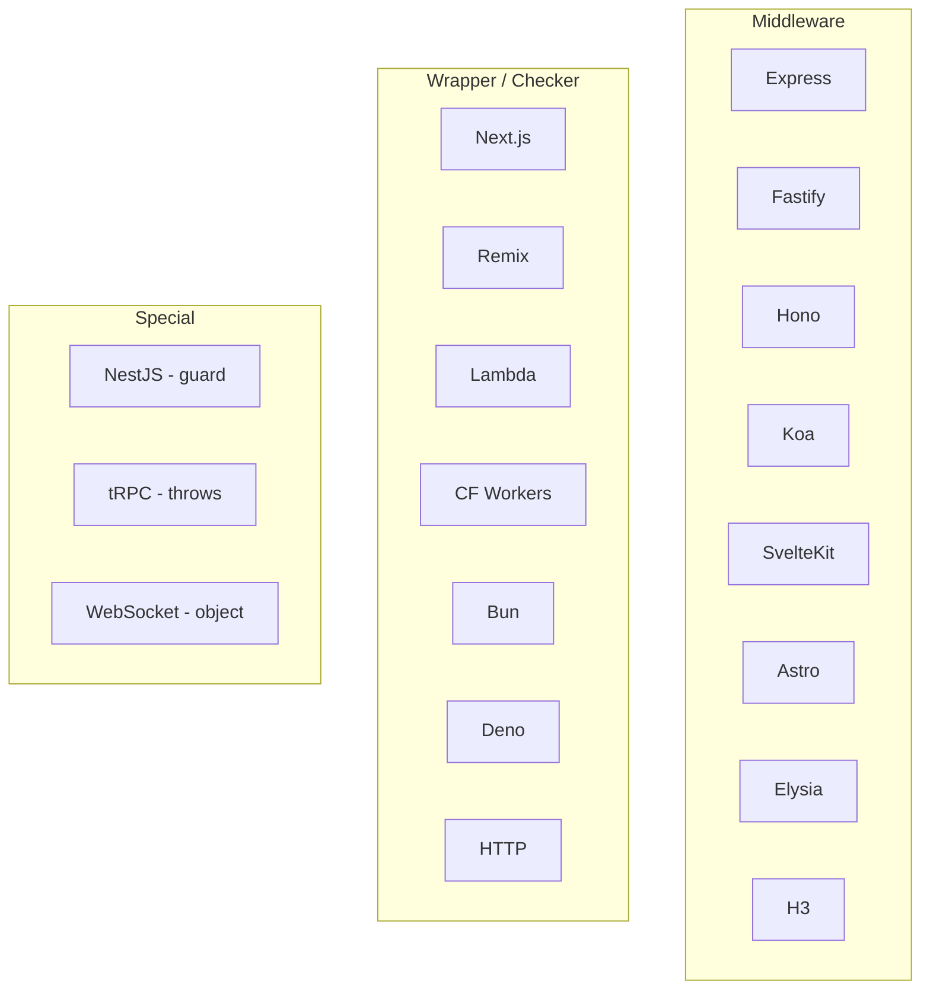

# Framework Adapters

Every adapter exports a single function: **`rateLimit`**.

```ts
import { rateLimit } from '@tzezar/throtto/adapters/{framework}'
```

This is the only export you need to remember. The function signature varies slightly by adapter category, but the name is always the same.

---

## Overview

Adapters fall into three categories based on how they integrate with their target framework:



| Category | Behavior | String preset? |
|----------|----------|----------------|
| **Middleware** | Returns framework-compatible middleware function | ✅ Yes |
| **Wrapper/Checker** | Accepts optional handler as 2nd argument. Without handler → checker; with handler → wrapper | ✅ Yes |
| **Special: NestJS** | Returns `{ canActivate(context) }` guard object | ❌ Config object only |
| **Special: tRPC** | Throws `TRPCError` on deny. Requires `key` | ❌ Config object only |
| **Special: WebSocket** | Returns object with `checkConnection`, `checkMessage`, `reset`. Requires `key` | ❌ Config object only |

---

## Using throtto without an adapter

The core library works anywhere - no framework needed. Adapters are convenience wrappers around this:

```ts
import { createLimiter } from '@tzezar/throtto'

const limiter = createLimiter('100/minute')
const result = await limiter.check('user-123')

if (!result.allowed) {
  // denied - result.retryAfter tells you when to try again
}

// Works in ANY context - serverless, edge, CLI, tests, etc.
```

Use an adapter when you want automatic key extraction (usually from IP), response headers, and deny responses handled for you.

---

## Common config

All adapters that accept a config object support these shared options:

| Option | Type | Default | Description |
|--------|------|---------|-------------|
| `limit` | `number` | - | Max requests in the window |
| `window` | `string` | - | Time window (`'1m'`, `'15m'`, `'1h'`, `'1d'`) |
| `limiter` | `Limiter` | - | Pre-built limiter (overrides `limit`/`window`) |
| `key` | `(req) => string` | IP address | Custom key extraction function |
| `skipPaths` | `string[]` | `[]` | Paths to bypass rate limiting |
| `skipMethods` | `string[]` | `[]` | HTTP methods to bypass (e.g. `['OPTIONS']`) |
| `headerFormat` | `'draft-7' \| 'draft-6' \| 'legacy'` | `'draft-7'` | Rate limit header style |
| `statusCode` | `number` | `429` | HTTP status when denied |
| `onDeny` | varies by adapter | - | Custom deny response handler |

When using a **string preset** like `'100/minute'`, this is shorthand for `{ limit: 100, window: '1m' }`.

Supported string preset formats:
- `'100/minute'` or `'100/m'`
- `'1000/hour'` or `'1000/h'`
- `'10/second'` or `'10/s'`
- `'10000/day'` or `'10000/d'`
- `'100/15m'` - custom durations (any parseable duration: `30s`, `6h`, `1h30m`, etc.)

---

## Express

```ts
import { rateLimit } from '@tzezar/throtto/adapters/express'

// Global
app.use(rateLimit('100/minute'))

// Per-route
app.post('/login', rateLimit({ limit: 5, window: '15m' }), handler)
```

Config object form:

```ts
app.use(rateLimit({
  limit: 100,
  window: '1m',
  skipPaths: ['/health'],
  key: (req) => req.headers['x-forwarded-for'] ?? req.ip,
}))
```

---

## Fastify

```ts
import { rateLimit } from '@tzezar/throtto/adapters/fastify'

// Global hook
app.addHook('onRequest', rateLimit('100/minute'))

// Per-route
app.route({
  method: 'POST',
  url: '/login',
  onRequest: rateLimit({ limit: 5, window: '15m' }),
  handler: loginHandler,
})
```

---

## Hono

```ts
import { rateLimit } from '@tzezar/throtto/adapters/hono'

// Global
app.use('*', rateLimit('100/minute'))

// Scoped
app.use('/api/*', rateLimit({ limit: 200, window: '1m' }))
app.use('/auth/*', rateLimit({ limit: 5, window: '15m' }))
```

---

## Next.js (overloaded)

```ts
import { rateLimit } from '@tzezar/throtto/adapters/nextjs'
```

### As a checker (middleware.ts)

Without a handler argument, `rateLimit` returns a checker function. It returns a `Response` if denied, or `null` if allowed:

```ts
const check = rateLimit({ limit: 100, window: '1m', skipPaths: ['/_next'] })

export async function middleware(req) {
  return await check(req) ?? NextResponse.next()
}
```

### As a wrapper (route handler)

With a handler as the 2nd argument, it wraps the handler and auto-denies:

```ts
export const POST = rateLimit({ limit: 10, window: '1m' }, async (req) => {
  return Response.json({ ok: true })
})
```

---

## SvelteKit

```ts
import { rateLimit } from '@tzezar/throtto/adapters/sveltekit'

export const handle = rateLimit({ limit: 100, window: '1m', skipPaths: ['/health'] })
```

Compose with `sequence`:

```ts
import { sequence } from '@sveltejs/kit/hooks'

export const handle = sequence(
  rateLimit({ limit: 100, window: '1m', skipPaths: ['/health'] }),
  otherHandle
)
```

---

## Remix (overloaded)

```ts
import { rateLimit } from '@tzezar/throtto/adapters/remix'
```

### As a wrapper (action/loader)

```ts
export const action = rateLimit({ limit: 5, window: '15m' }, async ({ request }) => {
  return Response.json({ ok: true })
})
```

### As a checker

```ts
const check = rateLimit({ limit: 100, window: '1m' })

export async function loader({ request, params }) {
  const denied = await check({ request, params })
  if (denied) return denied
  return Response.json({ data: 'ok' })
}
```

---

## Astro

```ts
import { rateLimit } from '@tzezar/throtto/adapters/astro'

export const onRequest = rateLimit({ limit: 100, window: '1m', skipPaths: ['/health'] })
```

Per-endpoint (API route):

```ts
import { rateLimit } from '@tzezar/throtto/adapters/astro'

const check = rateLimit({ limit: 10, window: '1m' })

export const POST: APIRoute = async ({ request }) => {
  const denied = await check(request)
  if (denied) return denied
  return Response.json({ ok: true })
}
```

---

## NestJS (guard)

`rateLimit` returns a guard object with `canActivate(context)`:

```ts
import { rateLimit } from '@tzezar/throtto/adapters/nestjs'

@UseGuards(rateLimit({ limit: 100, window: '1m' }))
@Controller('api')
export class ApiController {

  @UseGuards(rateLimit({ limit: 5, window: '15m' }))
  @Post('login')
  login() { /* ... */ }

  @Get('users')
  listUsers() { /* ... */ }
}
```

Apply globally:

```ts
app.useGlobalGuards(rateLimit({ limit: 100, window: '1m' }))
```

---

## Elysia

```ts
import { rateLimit } from '@tzezar/throtto/adapters/elysia'

app.onBeforeHandle(rateLimit('100/minute'))
```

Scoped:

```ts
const app = new Elysia()
  .group('/api', (app) =>
    app.onBeforeHandle(rateLimit('200/minute'))
  )
  .group('/auth', (app) =>
    app.onBeforeHandle(rateLimit({ limit: 5, window: '15m' }))
  )
```

---

## H3

```ts
import { rateLimit } from '@tzezar/throtto/adapters/h3'

export default defineEventHandler(rateLimit({ limit: 100, window: '1m' }))
```

As Nuxt server middleware (`server/middleware/rate-limit.ts`):

```ts
import { rateLimit } from '@tzezar/throtto/adapters/h3'

export default rateLimit({ limit: 100, window: '1m', skipPaths: ['/api/_health'] })
```

---

## tRPC (key required, throws on deny)

tRPC has no HTTP request by default in the middleware context, so you **must** provide a `key` function. On deny, it throws a `TRPCError` with code `TOO_MANY_REQUESTS`.

```ts
import { createLimiter } from '@tzezar/throtto'
import { rateLimit } from '@tzezar/throtto/adapters/trpc'

const rateLimited = t.procedure.use(rateLimit({
  limiter: createLimiter('100/minute'),
  key: (ctx) => ctx.userId,
}))

// Use as a base procedure
const router = t.router({
  listUsers: rateLimited.query(() => { /* ... */ }),
})
```

Per-procedure with different limits:

```ts
const strictLimit = rateLimit({
  limiter: createLimiter({ limit: 5, window: '15m' }),
  key: (ctx) => ctx.userId,
})

const router = t.router({
  resetPassword: t.procedure.use(strictLimit).mutation(() => { /* ... */ }),
})
```

> **No string preset available** - `key` is always required, so the config object form must be used.

---

## WebSocket (key required, returns object)

Returns an object with `checkConnection`, `checkMessage`, and `reset` methods:

```ts
import { createLimiter } from '@tzezar/throtto'
import { rateLimit } from '@tzezar/throtto/adapters/websocket'

const ws = rateLimit({
  limiter: createLimiter('60/minute'),
  key: (info) => info.id ?? 'unknown',
})

// On connection attempt
const connectionResult = ws.checkConnection(info)

// On each message
const messageResult = ws.checkMessage(info)

// Reset on disconnect
ws.reset(info)
```

> **No string preset available** - `key` is always required, so the config object form must be used.

---

## Koa

```ts
import { rateLimit } from '@tzezar/throtto/adapters/koa'

// Global
app.use(rateLimit('100/minute'))

// With config
app.use(rateLimit({
  limit: 100,
  window: '1m',
  skipPaths: ['/health'],
}))
```

Per-route with koa-router:

```ts
router.post('/login', rateLimit({ limit: 5, window: '15m' }), loginHandler)
```

---

## AWS Lambda (overloaded)

```ts
import { rateLimit } from '@tzezar/throtto/adapters/lambda'
```

### As a wrapper

```ts
export const handler = rateLimit('100/minute', async (event) => ({
  statusCode: 200,
  headers: {},
  body: 'ok',
}))
```

### As a checker

```ts
const check = rateLimit('100/minute')

export const handler = async (event) => {
  const denied = await check(event)
  if (denied) return denied
  return { statusCode: 200, body: JSON.stringify({ ok: true }) }
}
```

---

## Cloudflare Workers (overloaded)

```ts
import { rateLimit } from '@tzezar/throtto/adapters/cloudflare-workers'

export default {
  fetch: rateLimit('100/minute', async (request, env, ctx) => {
    return new Response('ok')
  })
}
```

As a checker:

```ts
const check = rateLimit('100/minute')

export default {
  async fetch(request, env, ctx) {
    const denied = await check(request)
    if (denied) return denied
    return new Response('ok')
  }
}
```

---

## Bun (overloaded)

```ts
import { rateLimit } from '@tzezar/throtto/adapters/bun'

Bun.serve({
  fetch: rateLimit('100/minute', (req, server) => new Response('ok'))
})
```

As a checker:

```ts
const check = rateLimit('100/minute')

Bun.serve({
  async fetch(req, server) {
    const denied = await check(req)
    if (denied) return denied
    return new Response('ok')
  }
})
```

---

## Deno (overloaded)

```ts
import { rateLimit } from '@tzezar/throtto/adapters/deno'

Deno.serve(rateLimit('100/minute', (req, info) => new Response('ok')))
```

As a checker:

```ts
const check = rateLimit('100/minute')

Deno.serve(async (req, info) => {
  const denied = await check(req)
  if (denied) return denied
  return new Response('ok')
})
```

---

## Generic HTTP (overloaded)

A runtime-agnostic adapter for any environment that uses the standard `Request`/`Response` API:

```ts
import { rateLimit } from '@tzezar/throtto/adapters/http'

// Checker
const check = rateLimit('100/minute')

// Wrapper
const handler = rateLimit('100/minute', (req) => new Response('ok'))
```

---

## Composition with adapters

Use `createLimiter` + `pipe` to build advanced limiters, then pass them to any adapter:

```ts
import { createLimiter, pipe, withAllowlist } from '@tzezar/throtto'
import { rateLimit } from '@tzezar/throtto/adapters/express'

const limiter = pipe(
  createLimiter('1000/hour'),
  withAllowlist({ allowlist: ['admin'] })
)

app.use(rateLimit({ limiter, skipPaths: ['/health'] }))
```

This works with every adapter. When you pass a `limiter`, the `limit` and `window` options are ignored (the limiter already has those configured):

```ts
import { createLimiter, pipe, withAllowlist } from '@tzezar/throtto'
import { rateLimit } from '@tzezar/throtto/adapters/hono'

const limiter = pipe(
  createLimiter('50/minute'),
  withAllowlist({ allowlist: ['trusted-ip'] })
)

app.use('*', rateLimit({ limiter }))
```

---

## Writing a Custom Adapter

If your framework isn't listed, you can write an adapter in ~30 lines. The pattern:

1. Accept config (or string preset)
2. Resolve limiter from config
3. Return a framework-compatible handler/middleware
4. Inside: extract key → call `limiter.check(key)` → set headers → deny or continue

```ts
import { createLimiter } from '@tzezar/throtto'
import { toHeaders } from '@tzezar/throtto/http'
import type { Limiter, RateLimitResult } from '@tzezar/throtto'

interface AdapterConfig {
  limiter?: Limiter
  limit?: number
  window?: string
  key?: (req: Request) => string
  skipPaths?: string[]
  skipMethods?: string[]
}

type ConfigOrPreset = string | AdapterConfig

export function rateLimit(config: ConfigOrPreset) {
  const limiter = typeof config === 'string'
    ? createLimiter(config)
    : config.limiter ?? createLimiter({ limit: config.limit!, window: config.window! })
  const opts = typeof config === 'string' ? {} : config

  return async function middleware(req: Request): Promise<Response | null> {
    const url = new URL(req.url)

    if (opts.skipPaths?.some((p) => url.pathname.startsWith(p))) return null
    if (opts.skipMethods?.includes(req.method)) return null

    const key = opts.key?.(req) ?? req.headers.get('x-forwarded-for') ?? '127.0.0.1'
    const result = await limiter.check(key)
    const headers = toHeaders(result) // returns standard rate-limit headers

    if (!result.allowed) {
      return new Response('Too Many Requests', {
        status: 429,
        headers,
      })
    }

    // For middleware-style: return null to signal "continue"
    return null
  }
}
```

### Key utilities

The core package exports helpers to simplify adapter authoring:

| Utility | Purpose |
|---------|---------|
| `createLimiter(preset)` | Accepts a string preset like `'100/minute'` or a config object |
| `toHeaders(result)` | Returns a `Headers` object with rate-limit headers (from `@tzezar/throtto/http`) |
| `result.retryAfter` | Seconds until the client can retry |
| `result.remaining` | Remaining requests in the current window |
| `result.resetAt` | Unix timestamp when the window resets |
