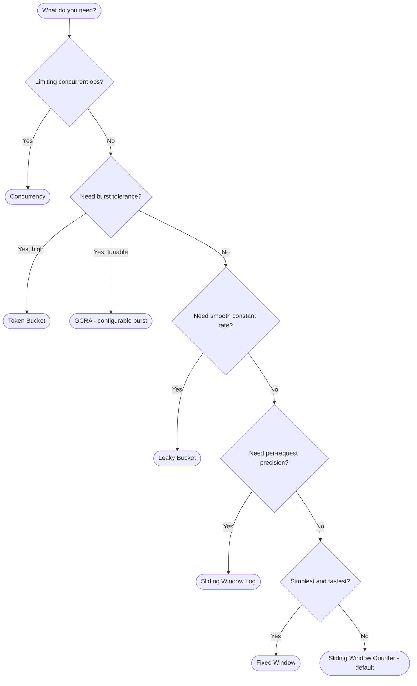

# Algorithms

throtto ships 7 battle-tested rate limiting algorithms. Each has different trade-offs in accuracy, memory usage, and burst tolerance. This guide helps you pick the right one - and shows you exactly how to configure it.

## Quick Comparison

| Algorithm | Best For | Burst Tolerance | Memory | Accuracy |
|---|---|---|---|---|
| Fixed Window | Simple limits, low overhead | ⚠️ 2× burst at boundary | O(1) | Low |
| Sliding Window Counter | General-purpose API limiting | Low | O(1) | High |
| Sliding Window Log | Exact enforcement | None | O(n) | Exact |
| Token Bucket | APIs that allow bursts | High | O(1) | High |
| Leaky Bucket | Smooth, constant output | None | O(1) | High |
| GCRA | Cell-rate scheduling | Configurable | O(1) | High |
| Concurrency | Parallel execution limits | N/A | O(n) | Exact |

## Choosing an Algorithm



---

## Fixed Window

Divides time into fixed-size windows and counts requests in each. The counter resets when a new window starts.

### How It Works

```
Window 1 (0:00–1:00)          Window 2 (1:00–2:00)
├─ req req req ─── limit ──►  ├─ req ─── counter resets
│  count: 3                   │  count: 1
│  limit: 5                   │  limit: 5
```

### Configuration

```ts
import { fixedWindow } from '@tzezar/throtto'

const algo = fixedWindow({
  limit: 100,          // max requests per window
  window: '1m',        // window duration (string or ms)
  alignment: 'floor',  // optional: snap windows to clock boundaries
})
```

The `alignment` option controls window start times:

- `'none'` (default) - each key's window starts on first request
- `'floor'` - snaps to clock boundaries (e.g. start of minute, hour)

### Using with `rateLimit()`

```ts
import { rateLimit } from '@tzezar/throtto'

const limiter = rateLimit({
  limit: 100,
  window: '1m',
  algorithm: 'fixed-window',
})
```

### When to Use

- Simple rate limiting where exact accuracy isn't critical
- Dashboards, analytics endpoints, non-critical limits
- When you want minimal computational overhead

### Watch Out For

**Boundary burst problem**: A user can send 100 requests at `0:59` and another 100 at `1:00` - effectively 200 requests in 2 seconds, despite a 100/min limit. If this matters, use Sliding Window Counter instead.

---

## Sliding Window Counter

The **default algorithm**. Combines two adjacent fixed windows with a weighted overlap to smooth out boundary spikes.

### How It Works

```
Previous Window          Current Window
count: 80                count: 20
                ├─── 40% overlap ───┤

effectiveCount = previousCount × overlapRatio + currentCount
               = 80 × 0.4 + 20
               = 52
```

The formula: `effectiveCount = previousCount × overlapRatio + currentCount`

Where `overlapRatio = (windowMs - elapsedInCurrentWindow) / windowMs`

### Configuration

```ts
import { slidingWindowCounter } from '@tzezar/throtto'

const algo = slidingWindowCounter({
  limit: 100,   // max requests per window
  window: '1m', // window duration
})
```

### Using with `rateLimit()`

```ts
import { rateLimit } from '@tzezar/throtto'

// Sliding window counter is the default - no algorithm option needed
const limiter = rateLimit({ limit: 100, window: '1m' })

// Or be explicit:
const limiter2 = rateLimit({
  limit: 100,
  window: '1m',
  algorithm: 'sliding-window-counter',
})

// Or use the shorthand preset:
const limiter3 = rateLimit('100/minute')
```

### When to Use

- **Best default for most API rate limiting**
- Any time you need a good balance of accuracy, memory, and burst protection
- REST APIs, GraphQL endpoints, webhook receivers

### Watch Out For

The weighted approximation is slightly less accurate than Sliding Window Log, but uses constant memory (O(1) vs O(n)). In practice, the approximation is close enough for virtually all use cases.

---

## Sliding Window Log

Stores a timestamp for every request within the window. The most accurate algorithm - every check prunes expired entries and counts what remains.

### How It Works

```
Window: 60s                    now
├──────────────────────────────┤
  t1  t2  t3  t4  t5  t6  t7    ← stored timestamps
  ↑ expired, pruned

count = timestamps still in window
```

### Configuration

```ts
import { slidingWindowLog } from '@tzezar/throtto'

const algo = slidingWindowLog({
  limit: 100,   // max requests within the window
  window: '1m', // window duration
})
```

### Using with `rateLimit()`

```ts
import { rateLimit } from '@tzezar/throtto'

const limiter = rateLimit({
  limit: 100,
  window: '1m',
  algorithm: 'sliding-window-log',
})
```

### When to Use

- Financial APIs where exact enforcement is legally required
- Compliance-sensitive systems
- Low-volume endpoints where O(n) memory is acceptable

### Watch Out For

**Memory grows with request volume.** Each request stores a timestamp. At 1,000 req/s with a 1-minute window, that's 60,000 entries per key. For high-throughput APIs, prefer Sliding Window Counter.

---

## Token Bucket

The bucket starts full at `capacity`. Each request consumes tokens. Tokens refill at a constant rate. This naturally allows bursts up to the bucket's capacity.

### How It Works

```
Capacity: 20 tokens
Refill: 10 tokens/second

 t=0   ████████████████████  20 tokens (full)
 t=0   burst of 15 requests
 t=0   █████                  5 tokens remaining
 t=1   ███████████████       15 tokens (refilled 10)
 t=2   ████████████████████  20 tokens (capped at capacity)
```

Refill is computed lazily - no timers needed.

### Configuration

```ts
import { tokenBucket } from '@tzezar/throtto'

const algo = tokenBucket({
  capacity: 20,           // max tokens (burst size)
  refillRate: 10,          // tokens added per interval
  refillInterval: '1s',    // how often tokens refill (default: '1s')
})
```

**Burst example**: `capacity: 20, refillRate: 10, refillInterval: '1s'` means a client can immediately send 20 requests, then sustain 10/sec after that.

### Using with `rateLimit()`

```ts
import { rateLimit } from '@tzezar/throtto'

// rateLimit maps limit → capacity and derives refill from the window
const limiter = rateLimit({
  limit: 100,
  window: '1m',
  algorithm: 'token-bucket',
})
```

> **Note**: `rateLimit()` maps `limit` to `capacity` and sets `refillRate` to `limit` over the full `window`. For fine-grained control over burst vs. sustained rate, use `createLimiter()` with `tokenBucket()` directly (see [Low-Level Usage](#using-with-createlimiter-low-level)).

### When to Use

- APIs that should tolerate bursts (CDNs, real-time apps, chat)
- When you want to allow a "credit" of requests that accumulates during idle time
- Client-facing APIs where occasional spikes are acceptable

### Watch Out For

If burst tolerance is undesirable, use Leaky Bucket or GCRA instead. Token Bucket explicitly _allows_ bursts - that's its defining feature, not a bug.

---

## Leaky Bucket

Requests fill a bucket that drains at a constant rate. If the bucket is full, requests are rejected. The output rate is always smooth.

### How It Works

```
Capacity: 10
Leak rate: 2/second

  requests ──►  ┌─────────┐
                │ ████████ │ queue fills up
                │ ██████   │
                └────┬─────┘
                     │ leaks at constant rate
                     ▼
              2 req/sec output
```

Like Token Bucket, the drain is computed lazily on each check.

### Configuration

```ts
import { leakyBucket } from '@tzezar/throtto'

const algo = leakyBucket({
  capacity: 100,          // max queue size
  leakRate: 10,            // items drained per interval
  leakInterval: '1s',      // drain frequency (default: '1s')
})
```

### Using with `rateLimit()`

```ts
import { rateLimit } from '@tzezar/throtto'

const limiter = rateLimit({
  limit: 100,
  window: '1m',
  algorithm: 'leaky-bucket',
})
```

### Token Bucket vs. Leaky Bucket

| | Token Bucket | Leaky Bucket |
|---|---|---|
| Starts | Full (allows immediate burst) | Empty (no burst) |
| Burst | Up to capacity | None - constant drain rate |
| Controls | Input rate (how fast you can consume) | Output rate (how fast work is released) |
| Best for | Tolerating spikes | Traffic shaping, upstream protection |

### When to Use

- Traffic shaping - smoothing bursty traffic into a steady flow
- Protecting upstream services from request spikes
- Queue-based systems where constant throughput matters

### Watch Out For

Leaky Bucket rejects requests when the queue is full, even if the overall rate is within limits. If you want to allow occasional bursts, use Token Bucket.

---

## GCRA (Generic Cell Rate Algorithm)

A single-timestamp algorithm originally designed for ATM network cell-rate policing. Tracks only a **Theoretical Arrival Time (TAT)** - making it extremely memory efficient.

### How It Works

```
emission_interval = period / limit     (ideal spacing between requests)
delay_tolerance   = emission_interval × burst  (max burst window)

On each request:
  new_tat = max(current_tat, now) + emission_interval × cost
  allow_at = new_tat - delay_tolerance

  if allow_at ≤ now → ALLOW (update TAT)
  else             → DENY  (keep old TAT)
```

### Configuration

```ts
import { gcra } from '@tzezar/throtto'

const algo = gcra({
  limit: 100,     // requests per period
  period: '1m',   // time period
  burst: 20,      // max burst deviation (default: same as limit)
})
```

The `burst` parameter controls how much deviation from perfect spacing is allowed. A lower `burst` enforces stricter spacing; a higher value is more lenient with bursts.

When `burst` is omitted, it defaults to `limit`, which allows the most lenient burst behavior.

### Using with `rateLimit()`

```ts
import { rateLimit } from '@tzezar/throtto'

const limiter = rateLimit({
  limit: 100,
  window: '1m',
  algorithm: 'gcra',
})
```

### When to Use

- When memory is at a premium (only 1 number stored per key)
- High-cardinality keys (millions of unique users/IPs)
- Telecom-style cell-rate limiting
- As a drop-in replacement for Sliding Window Counter with lower memory

### Watch Out For

GCRA's behavior can be unintuitive at first - it doesn't count requests, it schedules them. The `burst` parameter needs tuning: too low and legitimate traffic gets rejected, too high and it behaves like Token Bucket.

---

## Concurrency

Unlike the other 6 algorithms, Concurrency doesn't limit _rate_ - it limits the number of **simultaneous active operations**. Each allowed request gets a "ticket" that must be released when the work is done.

### How It Works

```
maxConcurrent: 3

  Slot 1: ████████ (active)
  Slot 2: ████████████████ (active)
  Slot 3: ████ (active)
  Request 4: DENIED (all slots in use)

  Slot 1 released:
  Slot 1: ██████ (request 4 can now proceed)
```

Tickets auto-expire after `ticketTtl` to prevent leaked slots from blocking the system.

### Configuration

```ts
import { concurrency } from '@tzezar/throtto'

const algo = concurrency({
  maxConcurrent: 5,     // max parallel operations
  ticketTtl: '30s',      // auto-release timeout (default: '30s')
})
```

### Using with `rateLimit()` and Releasing Tickets

```ts
import { rateLimit } from '@tzezar/throtto'

const limiter = rateLimit({
  limit: 5,
  window: '30s',
  algorithm: 'concurrency',
})

const result = await limiter.check('user-1')
if (result.allowed) {
  try {
    await doExpensiveWork()
  } finally {
    await limiter.reset('user-1') // release the slot
  }
}
```

> **⚠️ `reset()` means different things depending on the algorithm:**
>
> | Algorithm | `reset(key)` behavior |
> |---|---|
> | **Concurrency** | Releases one ticket (slot) for the key |
> | **All others** | Clears ALL rate limit state for the key (full reset) |
>
> This is because concurrency tracks active slots, not request counts. "Resetting" a concurrency key means releasing the current operation's hold. For other algorithms, it means wiping the counter/bucket entirely.

### Low-Level Ticket Release

When using `createLimiter()` directly, you get access to `releaseTicket` for fine-grained control:

```ts
import { createLimiter, concurrency, memoryStore, releaseTicket } from '@tzezar/throtto'

const store = memoryStore()

const limiter = createLimiter({
  algorithm: concurrency({ maxConcurrent: 5, ticketTtl: '30s' }),
  store,
})
```

### When to Use

- Database connection pooling
- File upload limits
- Expensive computation (image processing, video transcoding)
- Any operation where you care about _how many things run at once_, not _how fast they arrive_

### Watch Out For

Always release tickets in a `finally` block - leaked tickets block slots until `ticketTtl` expires. Set `ticketTtl` to a reasonable upper bound for your operation's duration.

---

## Using with `createLimiter()` (Low-Level)

`rateLimit()` is a convenience wrapper. For full control over algorithm config, use `createLimiter()` with algorithm factory functions directly:

```ts
import { createLimiter, tokenBucket, memoryStore } from '@tzezar/throtto'

const limiter = createLimiter({
  algorithm: tokenBucket({
    capacity: 50,
    refillRate: 10,
    refillInterval: '1s',
  }),
  store: memoryStore(),
  prefix: 'api',
  failMode: 'open', // allow requests if the store is down
})

const result = await limiter.check('user-123')
if (result.allowed) {
  // proceed
}
```

This gives you independent control over burst size vs. sustained rate, custom stores, hooks, and more:

```ts
import { createLimiter, leakyBucket } from '@tzezar/throtto'
import { redisStore } from '@tzezar/throtto/stores/redis'

const limiter = createLimiter({
  algorithm: leakyBucket({
    capacity: 100,
    leakRate: 5,
    leakInterval: '1s',
  }),
  store: redisStore({ client: new Redis('redis://localhost:6379') }),
  prefix: 'uploads',
  hooks: {
    onDeny: (key, result) => console.warn(`Rate limited: ${key}`),
  },
})
```

---

## Custom Algorithms

You can implement your own algorithm by conforming to the `Algorithm` interface:

```ts
import type { Algorithm, AlgorithmResult, RateLimitInfo } from '@tzezar/throtto'

interface MyState {
  count: number
  windowStart: number
}

const myAlgorithm: Algorithm<MyState> = {
  type: 'my-algorithm',

  initialState(): MyState {
    return { count: 0, windowStart: 0 }
  },

  check(state: MyState | null, now: number, cost = 1): AlgorithmResult<MyState> {
    // Your logic here
    const current = state ?? this.initialState()
    const allowed = current.count + cost <= 100

    return {
      allowed,
      state: { count: current.count + (allowed ? cost : 0), windowStart: current.windowStart || now },
      info: {
        limit: 100,
        remaining: Math.max(0, 100 - current.count - (allowed ? cost : 0)),
        resetAt: (current.windowStart || now) + 60_000,
        ...(allowed ? {} : { retryAfter: 1000 }),
      },
      ttlMs: 60_000,
    }
  },

  // Optional: read-only check without consuming capacity
  peek(state: MyState | null, now: number): RateLimitInfo {
    const current = state ?? this.initialState()
    return {
      limit: 100,
      remaining: Math.max(0, 100 - current.count),
      resetAt: (current.windowStart || now) + 60_000,
    }
  },
}
```

Then plug it in:

```ts
import { createLimiter, memoryStore } from '@tzezar/throtto'

const limiter = createLimiter({
  algorithm: myAlgorithm,
  store: memoryStore(),
})
```

### The `Algorithm` Interface

```ts
interface Algorithm<TState> {
  type: string
  initialState(): TState
  check(state: TState | null, now: number, cost?: number): AlgorithmResult<TState>
  peek?(state: TState | null, now: number): RateLimitInfo
}

interface AlgorithmResult<TState> {
  allowed: boolean          // whether the request is allowed
  state: TState             // updated state to persist
  info: RateLimitInfo       // limit/remaining/resetAt for headers
  ttlMs: number             // how long the store should keep this entry
}

interface RateLimitInfo {
  limit: number             // max capacity
  remaining: number         // remaining capacity
  resetAt: number           // unix ms when capacity resets
  retryAfter?: number       // ms until retry (only on deny)
}
```

- `state` - returned from `check()` and passed back on the next call. This is what gets persisted in the store.
- `now` - current time in unix milliseconds, provided by the limiter's clock.
- `cost` - how many units this request consumes (default: 1). Useful for weighted rate limiting.
- `peek` - optional read-only check. If omitted, the limiter will return `null` for peek calls.
- `ttlMs` - tells the store how long to keep the entry. After this, the entry can be garbage collected.
